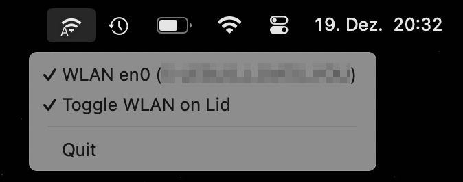
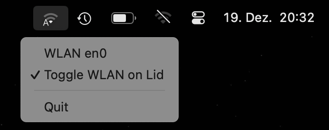

# go-auto-wlan

MacOS menu application to automatically switch WLAN off when laptop lid gets closed
and switch WLAN on again when laptop lid gets opened again.

Menu icon shows whether WLAN is powered on or off.

Menu option show WLAN power state and connected network. Click menu item to toggle WLAN power.

Use menu option to toggle whether WLAN will be switched on/off on lid open/close.

Screenshot WLAN power on:

Screenshot WLAN power off:

